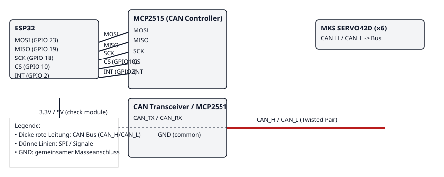

# 6-Achsen-Roboterarm (ESP32 + CAN)

Kompaktes Steuerungsprojekt für einen 6‑Achsen-Roboterarm. Die Hauptsteuerung läuft auf einem ESP32; Motorbefehle werden per CAN an MKS SERVO42D‑Treiber gesendet.

Kurz: `src/robot_arm.cpp` enthält die Firmware (CAN, MQTT, optional micro-ROS). Konfigurationen stehen in `src/micro_ros_config.h`.

Features
- CAN‑basierte Motorsteuerung (MKS posAbsolute / 0xFE)
- MQTT für G-code/JSON Eingaben (`robot_arm/command`) und `robot_arm/ack`
- Optional: micro-ROS Topics/Params (nur wenn micro-ROS Headers vorhanden)

Wichtiger Verdrahtungsplan
- ESP32 SPI (MOSI / MISO / SCK) -> MCP2515 MOSI / MISO / SCK (verwende denselben SPI-Bus, z.B. VSPI/HSPI).
- ESP32 `CAN_CS_PIN` (GPIO 10) -> MCP2515 CS
- ESP32 `CAN_INT_PIN` (GPIO 2) -> MCP2515 INT (Interrupt, active LOW)
- MCP2515 VCC -> Module-spezifische Versorgung (3.3V oder 5V). Prüfe dein Modul! Wenn es 5V benötigt, achte auf Pegelwandler oder ein 5V-tolerantes ESP32-Frontend.
- MCP2515 GND -> ESP32 GND (gemeinsame Masse)

- MCP2515 CAN_TX/CAN_RX (oder CAN_H/CAN_L vom Transceiver) -> MKS SERVO42D CAN_H / CAN_L (Bus parallel zu allen Treibern)
- MKS SERVO42D VCC -> externe Motorversorgung; gemeinsames GND mit ESP32/MCP2515

Grafische Skizze (vereinfacht):



Zusätzliche Hinweise
- Busabschlüsse: Am Anfang und Ende des CAN-Busses 120 Ω Abschlusswiderstände verwenden.
- Wenn Sie statt CAN direkt PWM/GPIO nutzen wollen: die Pin‑Defines stehen in `src/micro_ros_config.h` (`MOTOR_PIN_1`..`MOTOR_PIN_6`). Die Firmware deaktiviert PWM-Ausgänge standardmäßig.

Schnellstart
1. Einstellungen: `src/micro_ros_config.h` für Pins, CAN‑IDs, Limits prüfen.
2. Build & Upload:
   ```bash
   python -m platformio run --environment esp32dev --target upload
   ```
3. Monitor: `platformio device monitor -b 115200`

CAN-Nachrichten (kurz)
- Bewegungsframe (MKS `posAbsolute`): `[0xFE, speed_hi, speed_lo, accel, pos24_hi, pos16, pos8]` (7 Bytes)
- Einfaches 4‑Byte Statusformat (Position+Speed) wird ebenfalls lokal verarbeitet.

Konfiguration per micro-ROS / MQTT
- Param- und Konfigurations-Topics: `robot_arm/config`, `robot_arm/param_set`, `robot_arm/params` (siehe Code).

Lizenz
- Noch keine Lizenz festgelegt.

Bei Fragen zur Verdrahtung oder Anpassungen der Pinbelegung, sag mir, welche Hardware‑Revision (ESP32 Modul, MCP2515 Board) du verwendest — dann ergänze ich konkrete Pin-Nummern.
